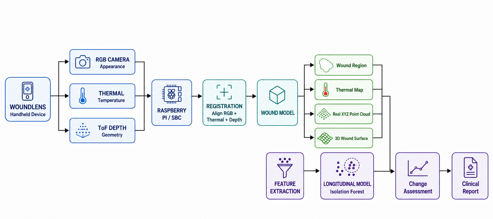

# WoundLens

> A multimodal wound-monitoring research prototype that brings RGB, thermal, and depth imaging into one clinician-facing workflow.

[](#quality-checks)
[](#architecture)
[](#safety-and-limitations)

WoundLens accepts an RGB image, a thermal image, and a depth image for a current wound scan. It localizes the visible wound region, produces relative-depth and 3D surface visualizations, saves the visit, and can generate a clinician-reviewed report. An optional longitudinal workflow uses the shipped, pre-trained change model to compare two visits from the same dataset case.

> **Research use only.** WoundLens is not a certified medical device and is not a substitute for clinical examination, diagnosis, treatment planning, or regulatory-cleared measurement.



## What Is Implemented

- **Current scan assessment:** upload RGB, thermal, and depth images without requiring prior patient history.
- **Visible wound localization:** automatic ROI selection with an explicit review-required state for lower-confidence segmentations.
- **Structural views:** real RGB ROI overlay, preserved thermal image, relative-depth map, and a depth-derived 3D surface visualization.
- **Patient workflow:** local SQLite-backed patient records, saved visits, clinical notes, clinician-controlled plans, and PDF reports.
- **Longitudinal comparison:** same-case baseline/current comparison using the saved joblib model artifacts. Results expose change level, model score, RGB/thermal/depth indices, and clinical-review flag.
- **Grounded documentation assistance:** optional server-side Groq summary built from saved measurements, data-quality facts, clinician notes, and same-patient history. A measured-output fallback keeps the workflow available when the provider is unavailable.
- **Responsive UI:** React Native / Expo interface for web and mobile.

## Architecture

```text
RGB + Thermal + Depth uploads
             |
             v
FastAPI analysis service
  - input validation and persistence
  - visible wound ROI localization
  - relative-depth reconstruction
  - 3D surface rendering
  - optional longitudinal model inference
             |
             +--> SQLite visits, stored scan assets, PDF reports
             |
             +--> Optional documentation-assistant service
             |
             v
Expo / React Native clinician interface
```

The current scan uses only the supplied images. The optional change-assessment route loads the existing model artifacts with `joblib`; it does **not** retrain the model during API startup or inference.

For module-level detail, see [docs/architecture.md](docs/architecture.md).

## Repository Layout

```text
.
|- App.tsx                         # Expo application state and navigation
|- src/
|  |- components/                  # Reusable UI primitives and navigation chrome
|  |- screens/                     # Dashboard, patients, scan, result, reports
|  |- services/woundlensApi.ts     # Typed HTTP boundary for the backend
|  `- theme.ts                     # Shared visual tokens
|- backend/
|  |- main.py                      # FastAPI routes and imaging workflow
|  |- persistence.py               # SQLite persistence boundary
|  |- report_service.py            # PDF report renderer
|  |- services/                    # Storage, AI, report, and analysis boundaries
|  `- requirements.txt             # Python dependencies
|- woundlens_trained_model/        # Versioned pre-trained joblib artifacts
|- notebooks/                      # Colab-origin model-development export
|- docs/                           # Architecture, safety, and contribution docs
`- .github/workflows/              # Continuous quality checks
```

Runtime data, generated reports, local datasets, environments, and secrets are deliberately excluded through `.gitignore`.

## Prerequisites

- Node.js 20 LTS recommended
- Python 3.12
- npm

## Quick Start

Clone the repository, then open two terminals in the project root.

### 1. Install dependencies

```powershell
npm ci
python -m venv .venv
.\.venv\Scripts\python.exe -m pip install --upgrade pip
.\.venv\Scripts\python.exe -m pip install -r backend\requirements.txt
```

### 2. Configure local environment

Copy the template without committing the resulting file:

```powershell
Copy-Item .env.example .env
```

The current-scan workflow needs no external dataset. These variables are optional:

| Variable | Purpose |
| --- | --- |
| `EXPO_PUBLIC_WOUNDLENS_API_URL` | Backend URL for Expo. Defaults to `http://127.0.0.1:8011`. |
| `WOUNDLENS_DATASET_DIR` | Root containing `case_*` folders for the optional longitudinal dataset workflow. |
| `GROQ_API_KEY` or `GROQ_API_KEYS` | Server-only optional documentation-assistant credentials. `GROQ_API_KEYS` accepts a comma-separated failover list. |
| `GROQ_MODEL` | Optional Groq model override. |

Never place credentials in `EXPO_PUBLIC_*` variables, source files, commits, reports, or issue screenshots.

### 3. Start the API

```powershell
.\.venv\Scripts\python.exe -m uvicorn backend.main:app --host 127.0.0.1 --port 8011 --reload
```

Verify it in a second terminal:

```powershell
Invoke-RestMethod http://127.0.0.1:8011/health
```

### 4. Start the web app

```powershell
$env:EXPO_PUBLIC_WOUNDLENS_API_URL = "http://127.0.0.1:8011"
npx expo start --web --clear
```

Press `w` in Expo, or open the local URL Expo prints. For mobile testing, use a reachable LAN address for the API rather than `127.0.0.1`.

## Primary Workflow

1. Create or select a patient.
2. Open **Scan Wound**.
3. Add the RGB, thermal, and depth images.
4. Select **Analyze Current Wound**.
5. Review the RGB ROI, thermal view, relative-depth map, 3D surface, and structural metrics.
6. Add clinician context and, if useful, generate the documentation summary.
7. Complete the clinician-controlled plan, mark the AI summary reviewed, and generate the report.

The app may flag a segmentation as **ROI review required**. That is a visibility warning, not a diagnosis; review the overlay before relying on the corresponding structural view.

## API Surface

| Route | Purpose |
| --- | --- |
| `GET /health` | Backend, database, and optional AI-provider configuration status. |
| `POST /analyze-current` | Current single-scan RGB + thermal + depth assessment. |
| `POST /analyze-followup` | Same-case longitudinal inference using saved artifacts. |
| `GET /patients`, `POST /patients` | Local patient records. |
| `GET /patients/{patient_id}/visits` | Saved visit history for one patient. |
| `POST /ai/explain-assessment/{visit_id}` | Grounded documentation summary with resilient local fallback. |
| `POST /reports/{visit_id}` | Generate a PDF from persisted measurements, images, notes, and plan. |

Interactive endpoint documentation is available at `http://127.0.0.1:8011/docs` while the API is running.

## Dataset Workflow

The optional historical flow expects a dataset root containing case folders such as:

```text
<dataset-root>/
`- case_12/
   |- day_124/results/scene_1/
   |  |- photo.png
   |  |- thermal.png
   |  `- depth.png
   `- day_313/results/scene_1/
      |- photo.png
      |- thermal.png
      `- depth.png
```

Set the root before starting Uvicorn:

```powershell
$env:WOUNDLENS_DATASET_DIR = "C:\path\to\dataset-root"
```

Do not commit de-identified datasets, uploaded scans, or generated patient reports.

## Quality Checks

Run these before opening a pull request:

```powershell
npm run lint
npm run typecheck
npx expo export --platform web --clear
.\.venv\Scripts\python.exe -m py_compile backend\main.py backend\persistence.py
```

GitHub Actions runs the equivalent frontend and backend import checks on pushes and pull requests.

## Safety and Limitations

- Relative-depth values describe reconstructed visible surface geometry. They are **not** calibrated physical depth in millimetres.
- Uploaded RGB, thermal, and depth images do not establish muscle involvement, infection, healing probability, surgery need, or treatment.
- Thermal imagery is preserved for relative visual review; this prototype does not claim calibrated Celsius interpretation.
- The longitudinal model flags unusual learned change patterns. A flag is not a diagnosis or probability of deterioration.
- Segmentation and reconstruction can be affected by image quality, angle, registration, depth data, capture conditions, and the populations represented by the development data.
- AI-generated text is documentation support only and requires clinician review.

Read [docs/safety-and-data.md](docs/safety-and-data.md) before using any real or potentially identifiable data.

## Contributing

See [CONTRIBUTING.md](CONTRIBUTING.md) for setup, branch, verification, and data-handling expectations. Project-specific AI behavior is documented in [WOUNDLENS_AI_AGENT.md](WOUNDLENS_AI_AGENT.md).

## License

No license has been selected yet. Confirm ownership and distribution rights for source code, datasets, model artifacts, and third-party assets before publishing under an open-source license.
